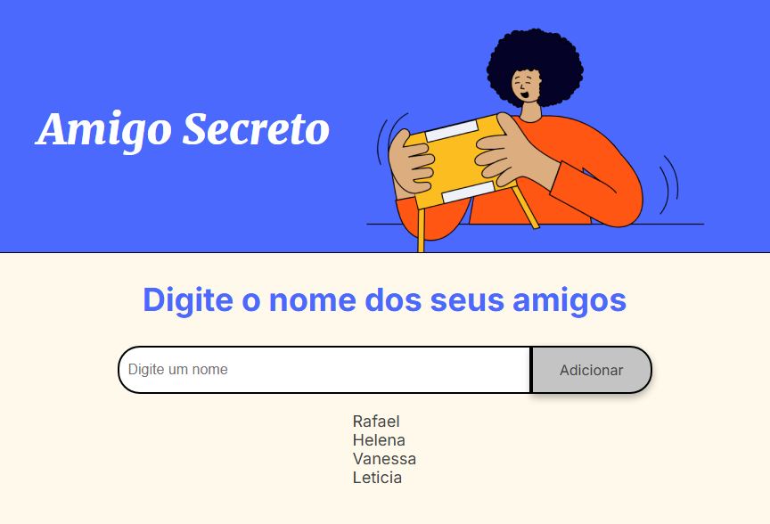
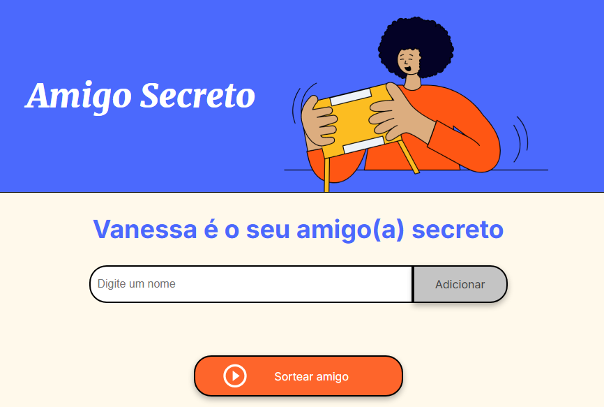

# 🎉 Sorteio de Amigo Secreto

## 📌 Sobre o Projeto
Este é um simples **sorteador de amigo secreto** desenvolvido com **HTML, CSS e JavaScript**. Ele permite que os usuários adicionem nomes a uma lista e realizem um sorteio aleatório para determinar quem será o amigo secreto de cada participante.

## 🚀 Funcionalidades
- Adicionar amigos à lista.
- Exibir a lista de participantes.
- Sortear um amigo secreto aleatoriamente.
- Limpar a lista para um novo sorteio.

## 🛠️ Tecnologias Utilizadas
<table>
  <tr>
    <th>Tecnologia</th>
    <th>Descrição</th>
  </tr>
  <tr>
    <td>HTML</td>
    <td>Estrutura da página</td>
  </tr>
  <tr>
    <td>CSS</td>
    <td>Estilização básica</td>
  </tr>
  <tr>
    <td>JavaScript</td>
    <td>Lógica do sorteio e manipulação da DOM</td>
  </tr>
</table>

## 🎮 Como Usar
1. Clone este repositório:
   ```sh
   git clone https://github.com/seu-usuario/sorteio-amigo-secreto.git
   ```
2. Acesse a pasta do projeto:
   ```sh
   cd sorteio-amigo-secreto
   ```
3. Abra o arquivo `index.html` no navegador.
4. Insira os nomes dos participantes.
5. Clique no botão para realizar o sorteio!

## 📷 Captura de Tela



Feito com ❤️ por [Rafael Guilherme](https://github.com/Rg96Dev).

